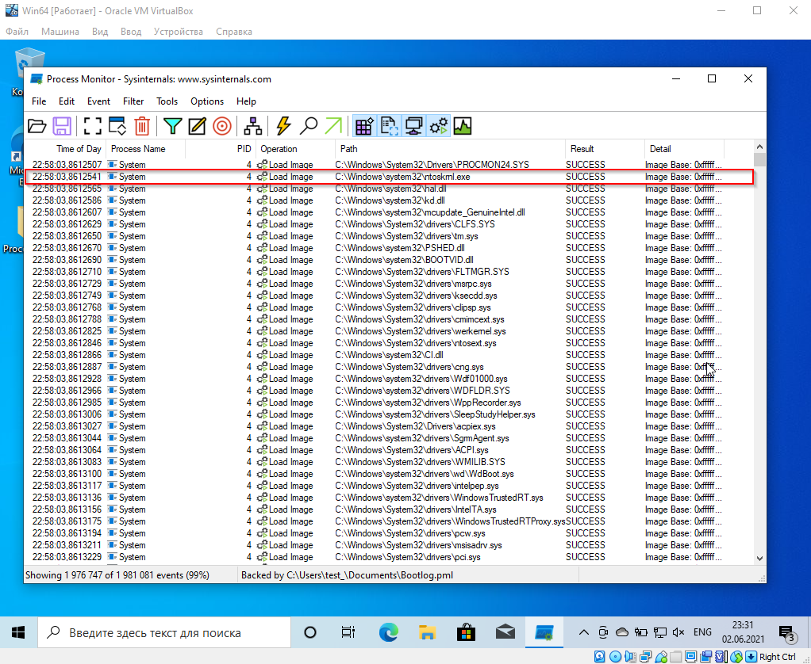
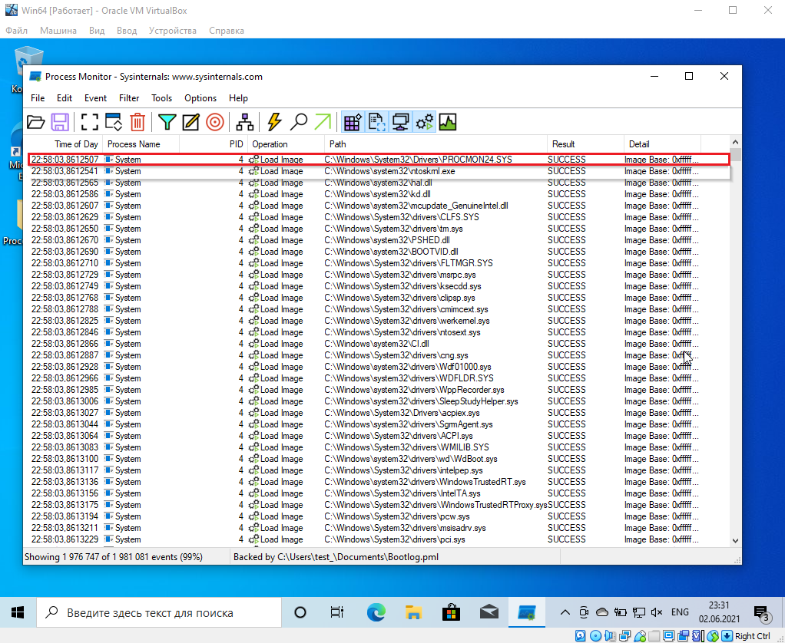
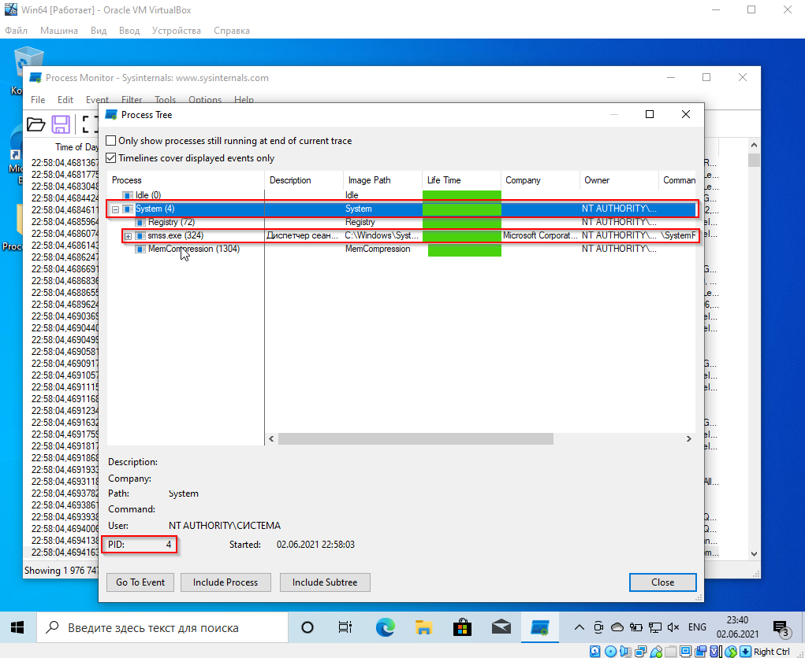
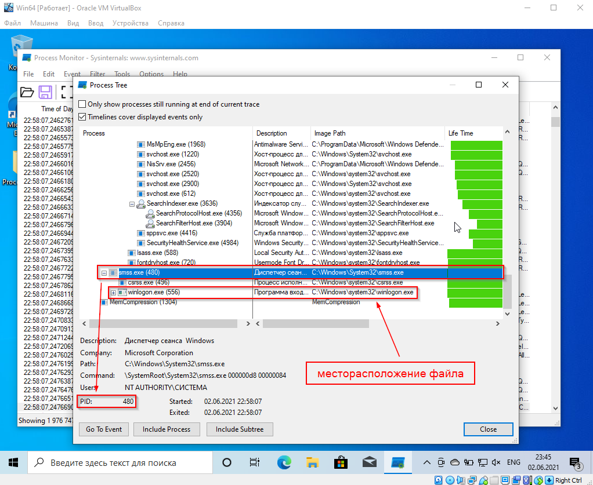
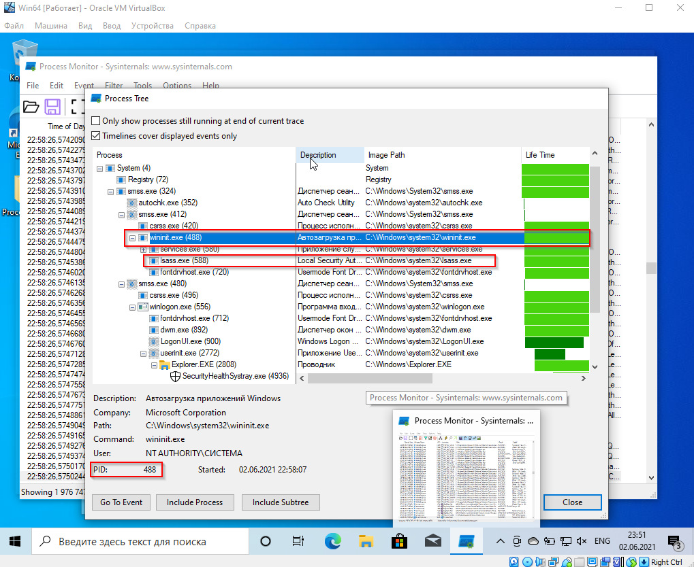
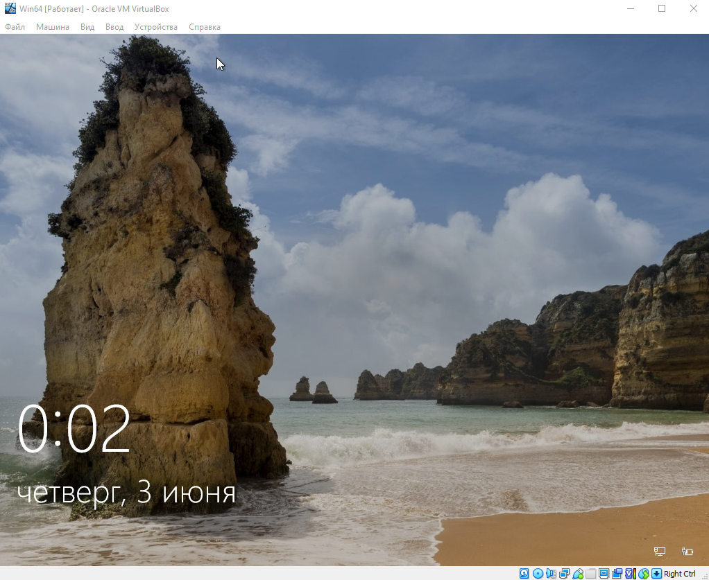
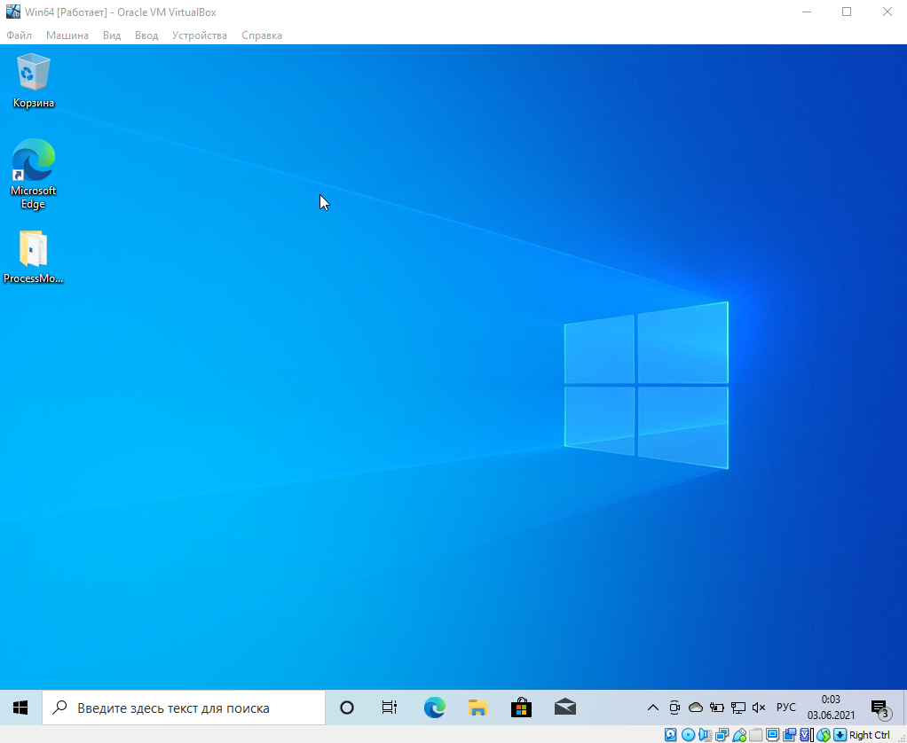

# Вопросы

### 1. Какой процесс отображается в логе первым? Какой у него PID?

    Первым в лог записан процесс типа "Драйвер": PROCMON24.SYS - это Драйвер монитора процесса - PID у него 4.
    Так как это драйвер мониторинга процессов, то следующий за ним процесс более значимый и я думаю его можно считать первым процессом в логе. И это ntoskrnl.exe - файл ядра операционных систем семейства Windows NT. Данный файл запускается загрузчиком ядра NTLDR в безопасном режиме. Простыми словами: Запускает ядро. PID у него 4.

### 2. Какой "драйвер" загружается первым? Что это за драйвер (ответьте своими словами)?

    Первым "Драйвер" в лог записан PROCMON24.SYS - это Драйвер монитора процесса. Этот драйвер собирает логи процессов с самого начала запуска системы, на какие-то милисекунды запускается раньше ядра.

### 3. Какой PID у родительского процесса для smss.exe (не у самого smss.exe, а у того, кто его создал)?

    System - PID у него 4.

### 4. Какой процесс является родительским для процесса winlogon.exe? Где расположен файл winlogon.exe?

    SMSS.exe - PID у него 480. Расположен файл winlogon.exe: C:\Windows\System32\winlogon.exe

### 5. Какой процесс является родительским для процесса lsass.exe?

    wininit.exe - PID у него 488.

### 6. Что будет если в таск менеджере (taskmgr.exe) завершить работу следующего процесса: Windows Log-on Application

    После завершения данного процесса система выходит на экран блокировки ОС, при этом закрывая все открытые приложения в системе.

